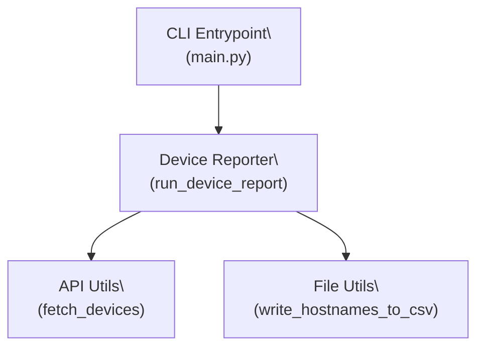

# Vendor Device Reporter

This tool connects to a vendor’s read-only API, retrieves a list of managed devices, extracts their hostnames, and saves them as a single-line `.csv` file for reporting or audit purposes.

---

## Features

- Secure API call using token-based authentication
- Hostnames extracted from vendor’s JSON response
- Output written to `hostnames.csv`
- Portable and CI-friendly (Makefile + .env)
- PMG-compliant structure and logging
- Full unit test coverage

---

## Usage

### 1. Set up your environment

Copy the sample secrets file:

```bash
cp src/config/secrets.env .env
```

Set your API token in `.env`:

```env
VENDOR_API_TOKEN=password123!
```

---

### 2. Install dependencies

```bash
make install
```

---

### 3. Run the tool

```bash
make run-report
```

Or directly:

```bash
PYTHONPATH=. python scripts/run_report.py --output=hostnames.csv
```

---

### Example Output

```
hostnames.csv:
cisco-sw1,cisco-sw2,arista-sw1,arista-sw2
```

---

## Architecture



---

## Project Structure

```
vendor_device_reporter/
├── src/
│   ├── cli/                 # CLI entrypoint
│   ├── config/              # Secrets/env schema (future YAML-ready)
│   ├── services/            # Orchestration logic
│   ├── utils/               # API client, file I/O, env loader
├── scripts/                 # CLI wrapper script
├── tests/                   # Unit tests (pytest)
├── .env                     # Environment token (ignored in git)
├── Makefile                 # CLI automation
├── requirements.txt         # Runtime deps
├── requirements-dev.txt     # Dev/test deps
```

---

## Testing

Run full test suite:

```bash
make test
```

Test coverage includes:

- API logic with mock responses
- Hostname parsing
- CSV file writing
- CLI dispatcher
- `.env` loading and validation

---

## Linting + Checks

Run all linters:

```bash
make lint
```

Run pre-commit hooks:

```bash
make check
```

---

## Secrets and Security

- Tokens loaded via `.env` (never hardcoded)
- `.env` is excluded by `.gitignore`
- HTTP headers use `Authorization: Bearer <token>`

---

## Sample CRON Job

```cron
0 1 * * * /usr/bin/env PYTHONPATH=/app /app/scripts/run_report.py --output /app/output/hostnames.csv
```

---

## Requirements

- Python 3.11+
- `httpx`, `python-dotenv`, `pytest`, `ruff`, `black`, `mypy`

---

## Makefile Commands

```bash
make install        # Install requirements
make run-report     # Run the CLI and write hostnames.csv
make test           # Run all unit tests
make lint           # Run ruff, black, isort, mypy
make check          # Run pre-commit hooks
```